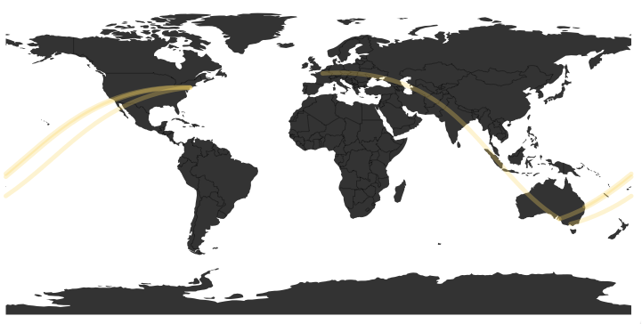

# great-circles
An attempt to create great circles arcs via d3, Shiny, htmlwidgets and R

clone the repo, and type devtools::install() to get your nice great circle widget. I suppose you could also install from github directly.

**What works:**
inst/examples/standalone-example.R 

This will/should display a world map with four arcs all coming our of Australia (two of them are almost coincident). Looks like this:

**What does not work:**
ints/examples/shiny-example.R

I suspect that this fails to render based on my D3 inexperience, specifically the way the greatCircles.js code is selecting the DOM elements for use in a Shiny container.
