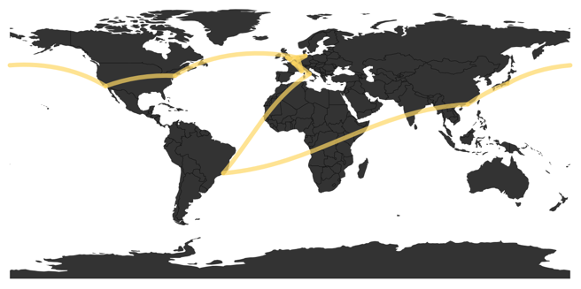

# great-circles
An attempt to create great circles arcs via d3, Shiny, htmlwidgets and R

clone the repo, and type devtools::install() to get your nice great circle widget. Or you can devtools::install_github("schnee/great-circles") and get it directly.

**What works:**
```
inst/examples/standalone-example.R 
```

This will/should display a world map with four arcs all terminating in Australia (two of them are almost coincident). Looks like this:



Running inside of Shiny works now (but I'm not so sure about the resize logic)
```
inst/examples/shiny-example.R
```

**TODOs:**

* Gradiate the arcs from start to finish
* Add support of annotations

